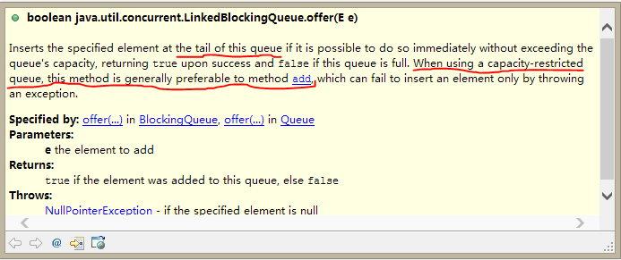

### 多线程[3]-线程池

在方法execute() 方法中的第二个if的判断：

	if (isRunning(c) && workQueue.offer(command)) {
            int recheck = ctl.get();
            if (! isRunning(recheck) && remove(command))
                reject(command);
            else if (workerCountOf(recheck) == 0)
                addWorker(null, false);
        }

从上一篇我们知道，c代表的是线程池的状态，如果线程池依旧在跑，那么 isRunning(c)  为true，那么就会直接的进行第二个判断：workQueue.offer(command)    
如果为false，那么就会跑到第三种情况，也就是第三个if，就是线程池已经不再动了，直接的执行：if (!addWorker(command, false))  reject(command); addWorker的
第二个参数为false，那么按照maxPoolSize 的边界判断进行增加人物，如果不能够增加失败，则reject这个人物。

我们继续看第二种情况的关键： workQueue.offer(command)   
这里的workQueue 是Executors 建立线程池的时候，设置的。具体的调用过程是：    

~~~
    public static ExecutorService newFixedThreadPool(int nThreads) {
        return new ThreadPoolExecutor(nThreads, nThreads,
                                      0L, TimeUnit.MILLISECONDS,
                                      **new LinkedBlockingQueue<Runnable>()**);
    }
~~~


可以看到，固定大小的线程池的工作的队列是 LinkedBlockingQueue<Runnable> 有序的阻塞队列，没有长度限制。我们看看workerQueue.offer 的逻辑：   
    
第三种情况：reject(command)的调用的逻辑是：   
```
 final void reject(Runnable command) {    
        handler.rejectedExecution(command, this);    
    }
```   
就是直接的抛出了异常   
```
 public void rejectedExecution(Runnable r, ThreadPoolExecutor e) {
            throw new RejectedExecutionException("Task " + r.toString() +
                                                 " rejected from " +
                                                 e.toString());
        }
```   

