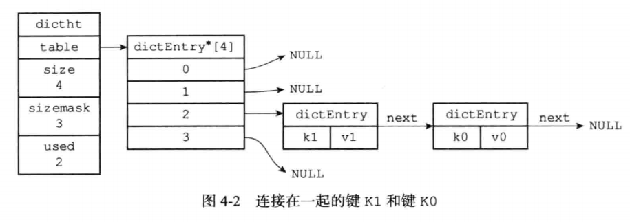

redis 作为缓存的框架，在网上搜集资料，然后整理出自己的关于redis的认识：

介绍：    

Redis is a very fast non-relational database that stores 
**a mapping of keys to five different types of values**.
Redis supports in-memory persistent storage on disk, replication to scale read performance, 
and client-side sharding 1 to scale write performance. 

redis的数据结构：  

Redis allows us to store keys that map to any one of five different
data structure types; STRINGs, LISTs, SETs, HASHes, and ZSETs. Each 
of the five different structures have some shared commands (DEL, TYPE, RENAME, and others), as well as
some commands that can only be used by one or two of the structures

redis数据中都是键值对，每一个键值都是有一个对象构成的，这个对象的键值为String，value值为五种类型：String，list，
hash，set sorted set object(有序集合)。

#### redis 的数据结构

##### 封装的字符串
1. redis的源码中自定义了一种使用最多的表示字符串的数据结构，简单动态字符串，简称为SDS，
而简单的使用C语言自带的String
类型。原因是：C 语言使用的这种简单的字符串表示方式， 并不能满足 Redis 
对字符串在**安全性、 效率以及功能**方面的要求 

SDS的数据结构：

```
struct sdshdr {
    unsigned int len; //字符串的长度
    unsigned int free;//额外分配的空间
    char buf[];//字符串的字符的保存
};
```

效率：获得字符串的长度  redis命令：STRLEN    
例子：拷本字符串，方法:    

```
//拼接字符串
sds sdscat(sds s, const char *t) {
    return sdscatlen(s, t, strlen(t));
}


sds sdscatlen(sds s, const void *t, size_t len) {
    struct sdshdr *sh;//一个指针
    size_t curlen = sdslen(s);// sds数据结构s的长度
    s = sdsMakeRoomFor(s,len); 
    if (s == NULL) return NULL;
    sh = (void*) (s-(sizeof(struct sdshdr)));
    memcpy(s+curlen, t, len);
    sh->len = curlen+len;
    sh->free = sh->free-len;
    s[curlen+len] = '\0';
    return s;
}
```
为了避免 C 字符串的这种缺陷， SDS 通过未使用空间解除了字符串长度和底层数组长
度之间的关联： 在 SDS 中， buf 数组的长度不一定就是字符数量加一， 数组里面可以包含
未使用的字节， 而这些字节的数量就由 SDS 的 free 属性记录。
通过未使用空间， SDS 实现了空间预分配和惰性空间释放两种优化策略。

空间预分配，空间小于1M的时候，保证free 和 len 一样大。大于1M的时候，就会只分配1M的空余空间。


2. 二进制安全
3. 兼容部分的C字符串函数

具体的比较的内容：  

   

##### 链表
2.1 redis中数据结构list对应的链表    

```
typedef struct listNode {
    struct listNode *prev;
    struct listNode *next;
    void *value;
} listNode;

typedef struct listIter {
    listNode *next;
    int direction;
} listIter;

typedef struct list {
//表头节点
    listNode *head;
//表尾巴    
listNode *tail;
//节点复制函数
    void *(*dup)(void *ptr);
//节点值释放函数
    void (*free)(void *ptr);
//节点值比较的函数
    int (*match)(void *ptr, void *key);
//包含的节点
    unsigned long len;
} list;
```

图示为：   

   


##### 字典（Map）数据结构

封装的数据结构：  

```
//每一个dictEntry保存着一个键值对，这个和hashMap里面的entry内部类比较的类似
typedef struct dictEntry {
    void *key;//主键
    union {//值
        void *val;//可以是一个指针
        uint64_t u64;//unit64_t 的整数
        int64_t s64; // int64_t的整数
        double d; //double类型
    } v;
    struct dictEntry *next;
} dictEntry;

//map的数据结构
typedef struct dictht {
    dictEntry **table;
    unsigned long size;// 哈希表的大小
    unsigned long sizemask;//hashtable掩码的，总是size-1
    unsigned long used;//该哈希表已有节点的数量
} dictht;

```
对应的图形是：   



redis 对哈希表的使用：  

typedef struct dict {
    dictType *type; //针对哈希表的封装的一个操作的类型
    void *privdata; //私有数据
    dictht ht[2]; // 哈希表
    long rehashidx; /* rehashing not in progress if rehashidx == -1 */
    int iterators; /* number of iterators currently running */
} dict;


